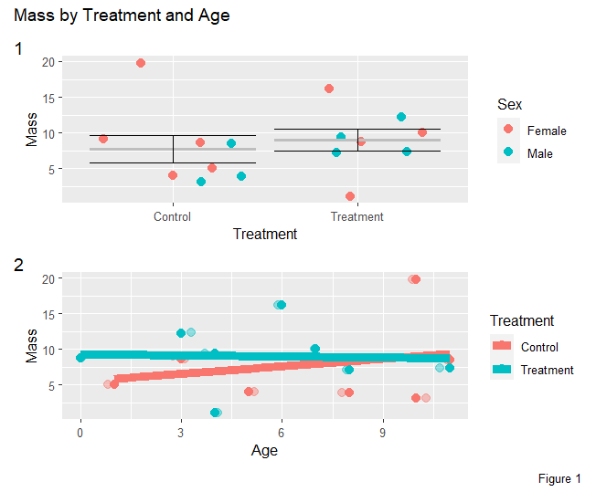

```{r setup, include=FALSE}
knitr::opts_chunk$set(echo = TRUE)
```
## load the packages needed: 
```
require(tidyverse)
require(ggplot2)
require(dplyr)

#load in data
MBT_ebird <- read_csv("https://github.com/mbtoomey/Biol_7263/blob/main/Data/MBT_ebird.csv?raw=true")
View(MBT_ebird)

```

#### PART 1

# Total # of species each month, each year, in each location

```
totals_MBT <- MBT_ebird %>%
  group_by(location, year, month) %>%
  count(scientific_name) %>%
  summarise(total_species = n())
view(totals_MBT)
```

# Make month a factor
```
MBT_month_fact <- totals_MBT %>%
  mutate(class = factor(month, levels = unique(MBT_ebird$month)))
view(MBT_month_fact)
```

# Plot # of species each month 
   - color points = year, facet by location
```
species_month_plot <- ggplot(MBT_month_fact, 
                             aes(month, total_species)) +
  geom_point(aes(color = year), size = 3) +
  facet_wrap(~location) +
  xlab("Month") +
  ylab("Total # of Species")
species_month_plot

```

#### Part 2
```
# use dataset from Assn. 5 
part2 <- read.csv("Assignments/Results/Assn5_Whole.csv")

view(part2)
```

# Plot a comparison of mass by treatment
```
mass_treatment_plot <- ggplot(part2, 
                              aes(Treatment, mass)) +
  geom_jitter(size = 3, aes(Treatment, mass, color = Sex)) +
  xlab("Treatment") +
  ylab("Mass") +
  #add our  stats
  stat_summary(fun = mean, geom = "crossbar", color = "grey") +
  stat_summary(geom = "errorbar") +
  labs(color = "Sex")
mass_treatment_plot
```
# Scatterplot of agexmass
```
age_mass_plot <- ggplot(part2, aes(age, mass, color = Treatment)) +
  geom_jitter(width = 0.3, alpha  = .4, size = 3) + #transparency overlaps
  geom_point(size=3) +
  xlab("Age") +
  ylab("Mass") +
  geom_smooth(size = 3, method = lm, se = FALSE) +
                labs(color = "Treatment")

age_mass_plot  
```

# Combine mass and age plots with patchwork
```
require(patchwork)

age_mass_treatment <- mass_treatment_plot / age_mass_plot
age_mass_treatment_plot <- age_mass_treatment + 
  plot_annotation("Mass by Treatment and Age",
                  tag_levels = "1", caption = "Figure 1")
age_mass_treatment_plot


```

## Plot Generated


# link to code
[Assn6 Code]()