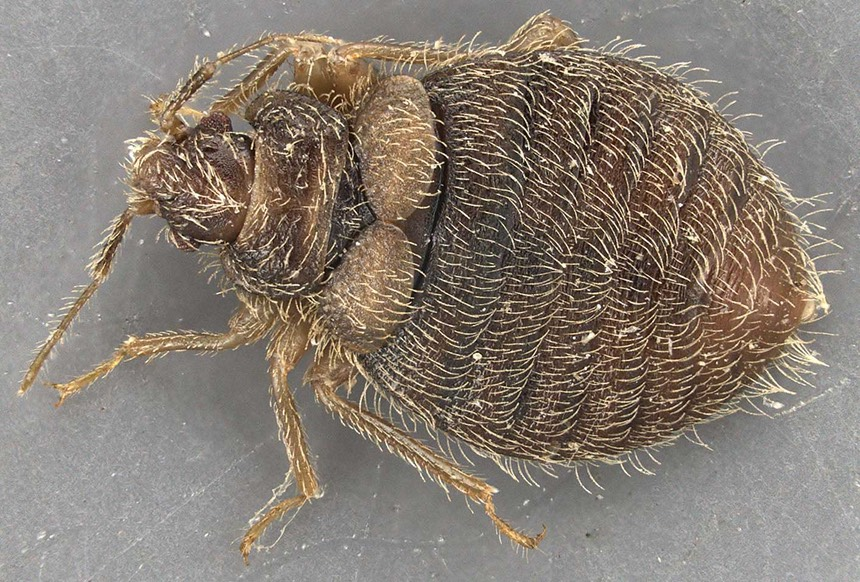

```{r setup, include=FALSE}
knitr::opts_chunk$set(echo = TRUE)
```

### Assignment 2 - update profile

___  

___  


# Educational Experience  
**University of Tulsa**  
- BS in Biology  
- PhD in Biology


# Research Interests  
**Website**  
- [Lab's Website](https://www.booth-lab.org/)  
- [ResearchGate](https://www.researchgate.net/profile/Laci-Cartmell)  

**My main reseaerch organism, the swallowbug**


```
```

## Projects in R
| DATE | ASSIGNMENT | LINK
| :-- | :-- | :--
|9-8-22 | Week 2 | [Assignment 1](https://laci-cartmell.github.io/CARTMELLBIOL7263.rmd/)  
|9-15-22 | Weel 3  | [Assignment 2](https://github.com/laci-cartmell/CARTMELLBIOL7263.rmd/tree/main/Assignments/)
|9-22-22 | Week 4 | [Assignment 3](https://github.com/laci-cartmell/CARTMELLBIOL7263.rmd/tree/main/Assignments/)

|9-22-22 | Oct.24th | Tanner Mierow Assignment](https://github.com/laci-cartmell/CARTMELLBIOL7263.rmd/tree/main/Assignments/GraduteLessons/TannerMierow)


