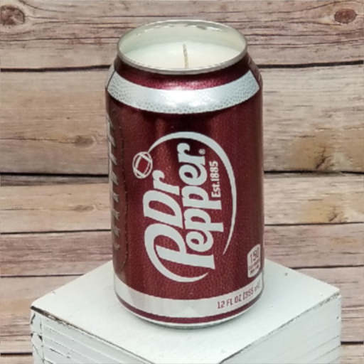
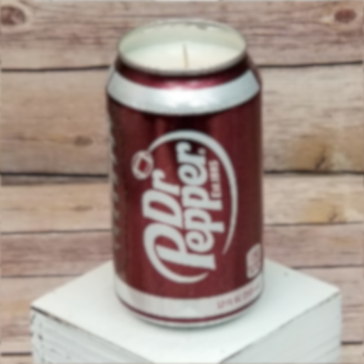
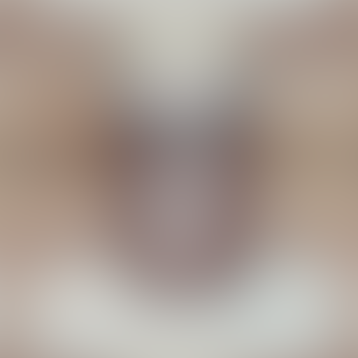
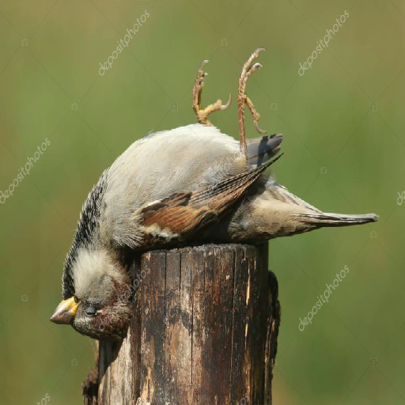
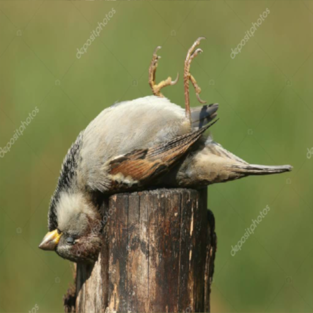
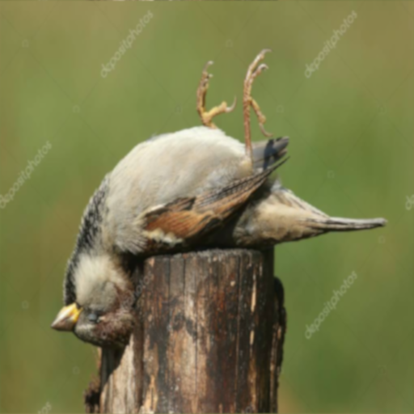

```{r setup, include=FALSE}
knitr::opts_chunk$set(echo = TRUE)
```

## Tanner Mierow Assignment

### Visual acuity of an organism can be found by : 

AcuityView(photo = img, distance = 2, realWidth = 4, eyeResolutionX = 8.14, eyeResolutionY = NULL, plot = T, output = "firstimage.jpg" )"
   
 - where distance is distance from image, realwidth is width object of interest,
 - eRX is organisms on x axis, most dont have a y


### Organism - CPD - MRA
      MRA = 1/CPD

 - Rock Dove - 18 - 0.0566
 - House Sparrow - 4.8 - 0.208
 - Black Vulture - 15.8 - 0.06
 - Jumping Spider - 12 - 0.083
 - Wolf Spider - 0.2 - 5

I chose a house sparrow image and checked the acuity of the rock dove, house sparrow, and black vulture against it. I used a pop can image some spiders will use them for habitats, esp, in urban areas! And then the dif. btw my two favorite spiders!


**Results at the different distances*


*
*
*
*
*

*
*
*

*
*
*

*
*
*

*
*
*
