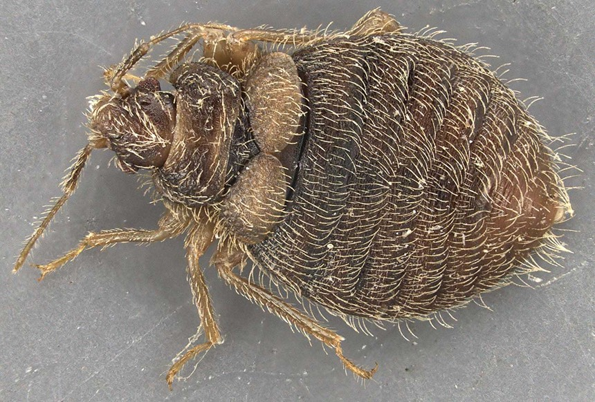

```{r setup, include=FALSE}
knitr::opts_chunk$set(echo = TRUE)
```

___

# Educational Experience  
**University of Tulsa**  
- BS in Biology  
- PhD in Biology

___

# Research Interests  
**Website**  
- [Lab's Website](https://www.booth-lab.org/)  
- [ResearchGate](https://www.researchgate.net/profile/Laci-Cartmell)  

**My main reseaerch organism, the swallowbug**


___  


## Projects in R
| DATE | ASSIGNMENT | LINK
| :-- | :-- | :--
|9-8-22 | Week 2 |[Assignment1](https://github.com/laci-cartmell/CARTMELLBIOL7263.rmd/blob/main/Assignments/Assignment1.Rmd)  
|9-15-22 | Week 3  |[Assignment2](https://laci-cartmell.github.io/CARTMELLBIOL7263.rmd/)
|9-18-22 | Week 4  |[Assignment3](https://github.com/laci-cartmell/CARTMELLBIOL7263.rmd/blob/main/Assignments/Assignment3_v1.html)
|10-24-22 | Week 8  | [Assignment7](https://github.com/laci-cartmell/CARTMELLBIOL7263.rmd/blob/main/Assignments/Assignment7.html)


## Lesson 
| DATE | ASSIGNMENT | LINK
| :-- | :-- | :--
|11-02-22 |PCA Lesson | [Cartmell_PCALesson](https://laci-cartmell.github.io/Cartmell_Lesson_PCA/)
|11-02-22 |PCA Practice | [PCAPractice_NLCD_CliffSwallow](https://github.com/laci-cartmell/Cartmell_Lesson_PCA/blob/main/Cartmell_NLCD_Rlesson.xlsx)


